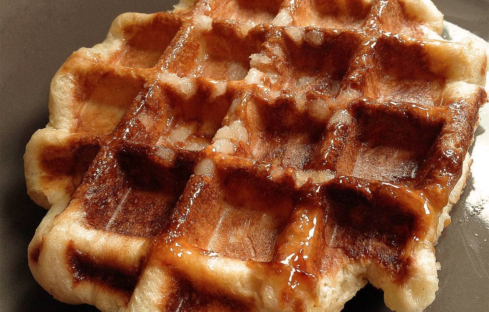

# Gaufres liégeoises - Liège Waffles

Gaufres liégeoises are the best gaufres, there is no doubt about it. For this recipe I cannot provide any original or traditional insight, so I will take advantage of OpenAI's o1 model to guide you into the magic of gaufres liégeoises. You can find the full conversation [here](https://chatgpt.com/share/6767fd8b-ad5c-8001-990c-9e9c0fe74153).

*Waffles* trace their origin back to medieval Europe, where grain-based batters were baked between metal plates. By the 17th and 18th centuries, they became popular across Belgium, France, and the Netherlands in various shapes and flavors.

*Liège waffles*, or gaufres de Liège, are said to have been popularized in the Principality of Liège (Belgium). Legend has it that an 18th-century prince-bishop requested a pastry studded with pearl sugar, a debated story linked to the rise of Wallonia’s sugar beet industry.

## Recipe
The following is a "median" recipe obtained from a compilation of sources. See the interactive plot [below](#interactive-recipes) for more details.

| Ingredient               | Q.ty (g)  | Norm. w.r.t. flour |
|--------------------------|-----------|--------------------|
| Flour                    | 200       | 1                  |
| Butter                   | 100       | 0.5                |
| Milk                     | 100       | 0.5                |
| Eggs                     | 50 (~1x)  | 0.4                |
| Pearl sugar              | 100       | 0.5                |
| Sugar (granulated/brown) | 10        | 0.05               |
| Yeast: fresh (dry)       | 15 (~5)   | 0.08 (0.01)        |
| Salt                     | 2         | 0.01               |
Optional: vanilla, honey, apples, cinnamon.

## Method
- Warm the milk (~30°C), dissolve yeast and a teaspoon of sugar.
- In a stand mixer, combine flour, salt, and regular sugar with eggs and milk-yeast mixture. Mix on low speed and let rest for 10 minutes.
- Incorporate soft butter in pieces, then knead until smooth.
- Cover and let rise until doubled (~1-2 hours, but depends on yeast q.ty and room temperature).
- Gently mix in pearl sugar.
- Divide into 6-8 dough balls. Let rest for 20-30 minutes.
- Preheat the waffle iron to ~160 °C. Bake for 3–5 minutes, or until the waffles are golden-brown and the sugar is caramelized.
- Transfer the baked waffles to a wire rack to cool slightly.

## Discussion
Achieving the perfect Gaufres Liégeoises requires careful attention to technique. Here are some points to consider:

- **Pearl Sugar**: It is essential to use pearl (not granulated) sugar, as it caramelizes during baking, creating the waffle's signature crunchy exterior. Add it just before shaping to prevent it from dissolving into the dough. As an alternative, you can try to break sugar cubes into smaller pieces.

- **Overnight Rest**: For enhanced flavor, allow the dough to rise in the refrigerator overnight. If you choose this method, remember to decrease the quantity of yeast. Bring it to room temperature before proceeding to the next steps. 

- **Cooking**: Typically, the waffle iron lack accurate temperature control. It is important that the temperature is not too low (>160°, the sugar won't caramelize) or too high (<190°, the sugar will burn). Some recipe suggest to 

- **Sodium bicarbonate**: In some recipes, you can find the addition of sodium bicarbonate to the dough (~3/1000 of the flour weight), as it helps the waffles to rise and become fluffier. 

- **Optional flavorings**: For an aromatic twist, you can mix in honey, vanilla, and/or cinnamon when adding the butter and/or grated apple when adding the pearl sugar. In carnivals near my hometown, you can find waffles by "Mr. Gaufres" with "honey-apple" flavor, they are delicious!

## Interactive Recipes
Recipes from different online sources sorted by butter/total weight ratio. References provided below. Desktop mode recommended.

👉 Press once to select a recipe, twice to deselect it. 

<iframe src="gaufre-plotly-cdn.html" frameborder="0" width="100%" height="710" scrolling="no" style="border:none;color-scheme: normal !important"></iframe>

## References

- [liegewaffle.wordpress.com](https://liegewaffle.wordpress.com/liege-waffle-recipe-liege-gaufre-recette/)
- [iletaitungateau.com](https://www.iletaitungateau.com/en/articles/385)
- [espace-concours.fr](https://www.espace-concours.fr/actualites/gaufres-de-liege-la-recette-authentique-de-grand-mere)
- [delices-d-edith.com](http://www.delices-d-edith.com/article-gaufres-de-liege-veritable-recette-86820070.html)
- [gaufrier.info](https://www.gaufrier.info/recettes/gaufres-liegeoises.html)
- [visitezliege.be](https://www.visitezliege.be/fr/page/authentique-gaufre-de-liege)
- [tonispastries.blogspot.com](https://tonispastries.blogspot.com/2008/11/gaufres-de-lige.html)
- [jojocuisine.fr](https://www.jojocuisine.fr/2014/04/gaufres-liegeoises.html)
- [quiaimebienpatissebien.com](https://quiaimebienpatissebien.jimdofree.com/2020/03/28/gaufres-liégeoises/)
- [maspatule.com](https://www.maspatule.com/blog/2020/05/23/recette-gaufres-liegeoises-de-conticini/)
- [matribuetmoi.com](https://www.matribuetmoi.com/post/gaufre-de-liège)
- [crumpetsandco.wordpress.com](https://crumpetsandco.wordpress.com/2014/05/04/gaufres-de-liege-waffles-di-liegi-liege-waffles/)
- [royalchill.com](https://www.royalchill.com/2019/02/08/comment-faire-des-gaufres-liegeoises-recette-de-philippe-conticini/)
- [greenpan.be](https://greenpan.be/fr/blogs/recettes/gaufres-liegeoises)
- [letabliergourmet.fr](https://letabliergourmet.fr/2019/03/gaufres-christophe-felder.html)
- [bulle-de-patisserie.fr](https://www.bulle-de-patisserie.fr/gaufres-de-liege)

