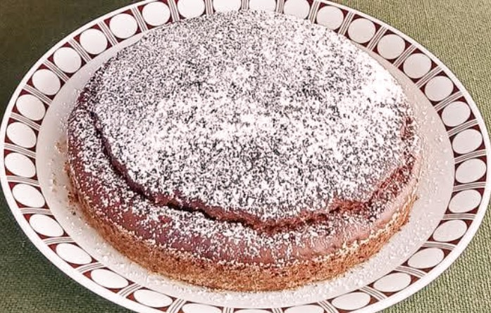

# Mingona - Chestnut Fudgy Cake

Mingona (castagnaccio, *miaza*) is a dense chestnut flour cake that became popular when chestnuts were "the bread of the poor" [1]. Pellegrino Artusi codified this preparation in 1891 as "Migliaccio di farina dolce volgarmente castagnaccio" (Recipe 240) [2]. The name *mingona*, used in the Bologna and Ferrara area, likely derives from the dialectal diminutives of Domenico or Domenica (e.g., Minghéin, Mingòun; feminine: Minghéina, Mingòuna), perhaps referring to the person who originally made the cake popular here.

Regional variants include: Tuscan ("Castagnaccio": pine nuts, walnuts, raisins, rosemary); Piedmontese (apples, milk); Ligurian (fennel seeds); more modern domestic (cocoa powder). Historically, chestnut flour was more economically accessible in Italy, requiring minimal processing beyond desiccation and milling.

## Ingredients
The following table provides quantities suitable for serving 10 people with a moderate appetite. Total mass: 700 g

| Component        | [v1] Q.ty (g) | [v2] Q.ty (g) |
|------------------|---------------|---------------|
| Chestnut flour   | 300           | 300           |
| Water            | 350           | -             |
| Milk             | -             | 350           |
| Cocoa powder     | 15            | 15            | 
| Seed/Olive oil   | 60            | 60            | 
| Sugar (optional) | 30            | 30            | 
| Salt             | 2             | 2             | 

*Note: Traditional formulations exclude sugar, relying exclusively on the flour's inherent sweetness (≈20-25% simple sugars). Modern palates may prefer its inclusion.*

## Method

1. **Flour preparation**: Sift the chestnut flour through a fine mesh to remove lumps and ensure uniform hydration.

2. **Hydration phase**: Create a slurry by gradually incorporating the liquid to the flour while whisking continuously to obtain a smooth, viscous batter. *The flour-to-water ratio of approximately 1:1.2 is critical; excessive hydration results in separation, insufficient hydration yields a dense, non-cohesive product.* 

    - v1: use all the water (20–25 °C).

    - v2: use all the milk (20–25 °C).

    - v1-2 gelatin: reserve ~50 g flour and ~70 g water. First mix these with hot water (80–90 °C) to make a smooth pre-gelatinized paste; then incorporate it into the cold-hydrated batter made with the remaining flour and water.

3. **Lipids**: Divide the oil into two parts: emulsify ~⅔ directly into the batter, and keep the remaining ~⅓ for the surface.

4. **Flavors**: Add cocoa powder, salt, and optional sugar. Mix until completely dissolved.

5. **Pan preparation and assembly**: Oil a 24–26 cm pan, ensuring the batter layer does not exceed 1–2 cm (traditional castagnaccio should not be thicker than 1 cm).
Pour the batter, level the surface, and apply the remaining oil as a thin film

6. **Thermal processing**: Bake at 180 °C (convection) or 190 °C (static) for 35–40 minutes.Indicators of doneness: characteristic surface fissures, lightly browned edges, and an internal temperature around 85 °C.

## Discussion

- **Textural considerations**: The absence of gluten networks and chemical leavening agents results in a dense, fudgy matrix. Internal structure depends on starch gelatinization and protein denaturation rather than gas cell stabilization.

- **Cocoa integration**: Cocoa powder (2–5% w/w) is a modern domestic addition. Its bitter, aromatic alkaloids complement the natural tannins of chestnut flour without altering the cake’s traditional identity (... at least this is what Anthropic/Claude/Opus 4.1 says).

<!-- ## References -->
[1]: https://www.filomagazine.it/2020/11/miaza-o-castagnaccio-la-ricetta-della-nonna-per-san-martino/
[2]: https://www.pellegrinoartusi.it/240-migliaccio-di-farina-dolce-volgarmente-detto-castagnaccio/