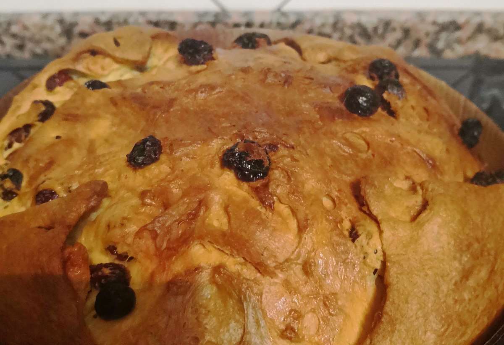

# Panettone - a.k.a. The Expanding Universe

Panettone is the dessert that Italian astrophysicists love the most to explain the expansion of the Universe. As for the Universe, the expansion of the Panettone is a mess to describe and usually requires some fine-tuning to obtain the final product. Here space-time is made out of gluten-egg-butter mixture (clusters and filaments), raisins/chocolate chips/candied fruit (visible matter), alveoli (voids), and yeast (dark energy).

## Ingredients
TBD

## Mehod
### First Dough
1) 600g strong flour (high W~380)
2) &nbsp; 30g powdered sourdough
3) 250g warm water (30°C)
4) 125g butter
5) &nbsp; 90g sugar + 125g egg yolk
6) 125g butter
7) &nbsp; 90g sugar + 125g egg yolk

Mix 1+2 and then 3, so that sugar doesn't "cook" the yolks (by denaturating its proteins). Add 4 and mix until a gluten mesh is formed (~20 min).

## Discussion
TBD

[1]: https://www.ferraraterraeacqua.it/en/flavours/typical-products/curly-pie-or-tagliatelle-pie?set_language=en

