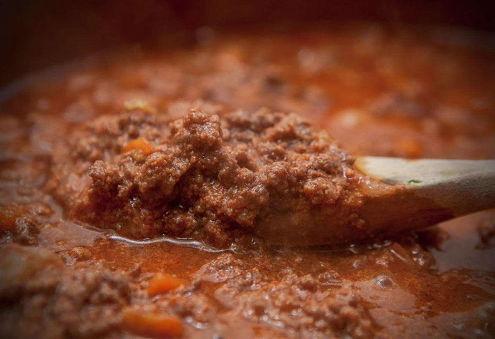

# Ragù - science and tradition 

Ragù (alla bolognese) is one of the most renowned sauces in Italian cuisine. In 1891, a first recipe appeared in the Pellegrino Artusi's book "La scienza in cucina e l'arte di mangiare bene" under the name "Maccheroni alla bolognese" [📰][1]. However, except from the common basis, many recipes developed and evolved within families. I will present only the one I use (the best of course!) taken from P. Lamborghini from Renazzo. A more detailed discussion on the history and science of ragù can be found in the book "La scienza della carne" by Dario Bressanini [📰🇮🇹][2].

> GENERAL RULE: If you have <4 hours... change recipe!

From a scientific point of view, a good searing (Maillard reaction) and a long cooking time (to dissolve the collagen) are essential. Usually, ragù is prepared in large quantities (>1 kg) and then put into the blast chiller for later consumption.

## Ingredients
The following tables give amounts to serve 15 (not too hungry) people. Mass: TBD. Calories: TBD.

### Meat
At least 40% of pork meat is needed for a richer flavor, less is discouraged. You can also go 100% pork if you want to eat ragù with, e.g., polenta or tortelloni di zucca.

| Ingredient  | Q.ty (g)  |
|-------------|-----------|
| Pork (Culatello, Loin, or Shoulder)    | 500    |
| Beef                                   | 500    |
| Salt                                   | 22     |
| Garlic (2x)                            | 5      |
Optional: pepper, nutmeg

### Cooking
In some recipes you may find butter and/or milk, but not in this one.

| Ingredient  | Q.ty (g)  |
|-------------|-----------|
| Celery (2x) | 100       |
| Carrot (2x) | 100       |
| Onion  (2x) | 200       |
| Wine        | 1000      |
Optional: tomato sauce, laurel

## Method
0. Season the minced meat with the ingredients on the side (salt, garlic, pepper, nutmeg, a little bit of wine) and leave it in the fridge to rest for 1 day.

1. Brown the chopped onion in a pan with oil, then add chopped carrot and celery.

2. After 5 minutes add the meat and brown it, then add half a liter of wine and continue cooking until it is reduced.

3. If you want to add the tomato pulp and stir, otherwise continue with more wine or water. Taste it to understand how much salt is missing and add it.

4. Let it simmer for at least other 2h. Divide it and freeze it in small cups. To season the pasta it will be sufficient to defrost and heat it.

## Discussion
TBD

