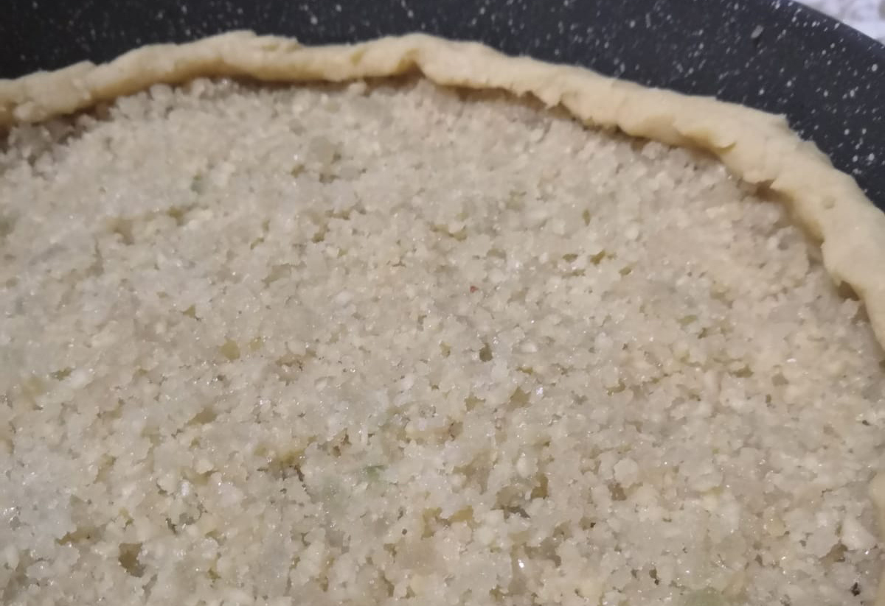

# Ricciolina - The curly cake

Ricciolina - better known as Torta di Tagliatelle (Noodles Cake) - is a sweet almond cake typical  dark chocolate cake typical of the province of Ferrara. Known since 1900s as Montenegrina Pie, it has been created for Elena Petrovich, queen of Montenegro, wife of Vittorio Emanuele II the King of Italy [📰][1]. 

## Ingredients and Method
The following tables give amounts to serve 10 (not too hungry) people. Mass: 400g. Calories: ≈2.2 kcal.

### Pastry
| Ingredient  | Q.ty (g)  | Norm. w.r.t. flour |
|--|------------------------|------------------------|
| Flour (low W)    | 300 |  1x   |
| Butter           | 120 | x     |
| Sugar            | 120 | x     |
| Egg yolk         | 50  | x     |
Optional (but recommended) flavorings: lemon zest, vanilla extract, salt, almond liqueur.

### Filling
| Ingredient  | Q.ty (g)  | Norm. w.r.t. flour |
|--|------------------------|------------------------|
| Peeled almonds      | 200 | 1x  |
| Sugar               | 200 | x   |
| Butter              | 50  | x   |
| Almond liqueur      | 50  | x   |
Optional: candied citron (by replacing the same amount of sugar).

### Topping
- 100g tagliatelle
- Icing sugar

## Method
TBD

## Discussion
TBD

[1]: https://www.ferraraterraeacqua.it/en/flavours/typical-products/curly-pie-or-tagliatelle-pie?set_language=en

