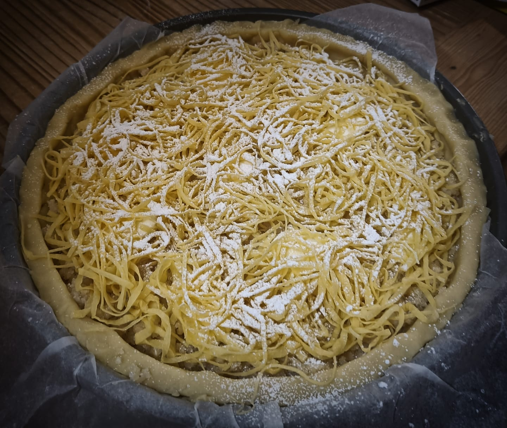

# Ricciolina - The curly cake

Ricciolina - better known as Torta di Tagliatelle (Noodles Cake) - is a sweet almond cake typical of the province of Ferrara. Known since 1900s as Montenegrina Pie, it seems it has been created for Elena Petrovich, queen of Montenegro, wife of Vittorio Emanuele II the King of Italy [📰][1]. 

## Ingredients and Method
Amount for ~10 people. Mass: 900g. Calories: ≈3.5 kcal. Specific calories: 4 cal/g. 

### Pastry
| Ingredient       | Q.ty (g)  | Norm. w.r.t. flour |
|------------------|-----------|--------------------|
| Flour (low W)    | 200       | 1                  |
| Butter           | 80        | 0.4                |
| Sugar            | 70        | 0.35               |
| Eggs             | 50 (1x)   | 0.25               |
| Baking powder    | 2         | 0.01               |
Optional (but recommended) flavorings: lemon zest, salt, vanilla extract, salt.

### Filling
| Ingredient       | Q.ty (g)  | Norm. w.r.t. almonds |
|------------------|-----------|----------------------|
| Peeled almonds   | 200       | 1              |
| Sugar            | 180       | 0.9            |
| Butter           | 100       | 0.5            |
| Almond liqueur   | 50        | 0.25           |
Optional: candied citron (by replacing the same amount of sugar).

### Topping
- 150 g tagliatelle (100 g flour + 1 egg; freshly made and thin)
- Powdered sugar

## Method

### Pastry (-1h before)
The base of the cake is shortcrust pastry. There are different methods to prepare it that will yield to different - but not necessarily wrong - results. Here I use the so-called "beat technique" to have a tasty, but not gummy shortcrust pastry: 
1. Whisk the butter until it reaches the consistency of a soft cream
2. Add the sugar (try also with powdered sugar, it allows to better entrain the incorporated air)
3. Add the beaten eggs
4. Sift the flour and incorporate
5. Let the dough rest in the fridge until it firms up (~1h)

### Tagliatelle 
Combine 100 g flour with 1 egg and kneed until smooth and elastic. Roll it out as thin as possible. Let it rest and proceed by making the filling (next paragraph). Later, roll it up tightly into a long, thin cylinder and slice it crosswise into thin ribbons. Unroll the ribbons and spread powdered sugar on them and mix.

### Filling
Grind half of the almonds in a blender. Chop the remaining ones with a knife into bigger (wheat grain size) pieces: this will give the cake a nice texture. Mix the sugar with all the almonds. Melt half of the butter and add it. 

### Assembling
Roll the dough out with a rolling pin until it is ~1 cm thick and place it to the base of a Ø 24 cm springform pan. Layer the filling, then top it with the remaining butter cut in slices. This process should aim to prevent the butter from soaking into the pastry before it hardens during cooking, but I cannot prove it. Lay the tagliatelle on top of the cake and sprinkle them again with powdered sugar.

### Cooking
Bake for approx. 30 m at 160° C by covering the cake with an alluminium foil on top. Remove it only in the final minutes to brown the tagliatelle. 

## Discussion
TBD

[1]: https://www.ferraraterraeacqua.it/en/flavours/typical-products/curly-pie-or-tagliatelle-pie?set_language=en

