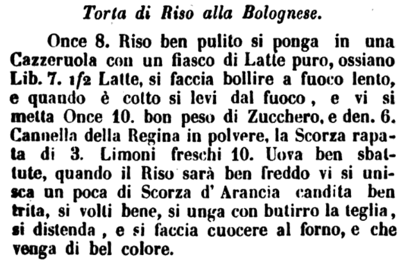

# Rice Cake

The rice cake ("torta di riso") is one of the most popular desserts in Emilia-Romagna. This recipe probably finds its origins in the blancmange ("biancomangiare"), a popular dessert in medieval Europe prepared with almonds, sugar and rose water. 

A brief research on Google Books reveals one of the earliest mentions of this cake's name in a publication titled "Codice gastrologico economico per istruzione dei giovani che vogliono professare l'arte della cucina, credenziere, e liquorista e per quelli che vogliono dilettarsi in simili arti" edited by G. Galletti and dated 1841 (see figure below).

<i>Codice Gastrologico Economico [...], G. Galletti, Firenze (1841)</i>[📰][1]

## Ingredients
The following table gives amounts for two versions of the recipe: modern (v1) and from the old book above (v2). 

| Ingredients  | v1, Q.ty (g) | v1, norm. | v2, Q.ty (g) | v2, norm.| 
|--------------|------------|------------|--------------|----------|
| Rice         | 250        | 1x         | 250          |  1x      |
| Sugar        | 100        | 0.4x       | 360          |  1.4x    |
| Almonds      | 100        | 0.4x       | -            |  _       |
| Eggs         | 200 (4x)   | 0.8x       | 500          |  2x      |
| Milk         | 1000       | 4x         | 2850         |  11x     |
| Almond Liqueur | 25      | 0.1x         | -         |  -     |
| + lemon zest, salt      |            |              |          |

TBD

## Method
1. Grate the lemon peel into the milk, add the sugar and bring to the boil. Add a pinch of salt, the rice and cook it.

2. Cool the rice, add the egg yolks, the peeled and chopped almonds, and finally, the whipped egg whites.

3. Pour the mixture into a buttered cake tin. Bake at 180° for about 45 minutes.

## Discussion
TBD

<!-- ## References -->
[1]: https://books.google.it/books?id=x0-p7JFBRUoC

