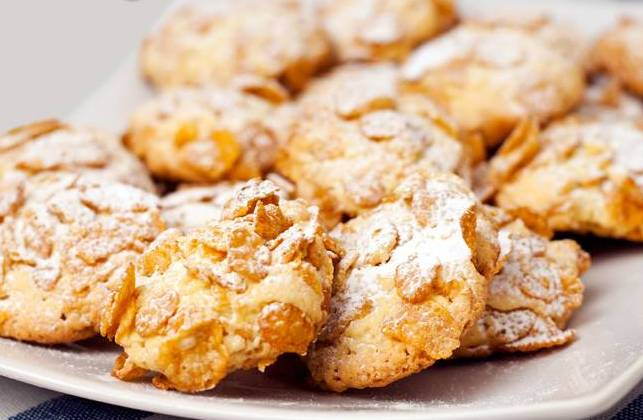

# Rose del deserto - Desert roses cookies

Rose del Deserto—literally "Desert Roses"—are crunchy cookies characterized by an irregular, mineral-like shape, reminiscent of desert rose crystals. They are not strongly tied to a single regional culinary tradition, but have become a common sight in many bakeries.

## Ingredients
Below is a (succesfully tested) version with orange zest flavoring. These quantities are for about 25 cookies.

| Ingredient   | Q.ty (g) | Norm. w.r.t. flour |
|--------------|-----|-------------------------|
| Flour        | 450 | 1x    |
| Butter       | 250 | 0.56x |
| Sugar        | 225 | 0.5x  |
| Eggs (3x)    | 125 | 0.28x |
| Almond flour | 100 | 0.22x |
| Baking powder| 16  | 0.04x |
| Orange zest (1x)  |  |       |
| + vanilla, salt | | |
| Corn flakes for the coating |  200   | 0.44      |

## Method   
1. Beat the softened butter and sugar together until you get a light, fluffy mixture. Creaming butter and sugar incorporates air pockets into the fat phase (butter), which helps produce a lighter, more tender cookie.

2. Incorporate the eggs, salt, and the flavorings (e.g., orange zest).

3. Whisk together the dry ingredients (flour, almond flour, and baking powder) and add them to the butter mixture. At this point, the dough should be soft but not too sticky. If it is too sticky, add a bit more flour.

4. Prepare a shallow bowl with cornflakes. Take a small piece of dough and roll it into a ball, then roll it in the cornflakes, pressing slightly so they adhere well. Place the balls on a baking sheet lined with parchment paper.

5. Bake the cookies at 160°C for about 20 minutes, or until the cornflakes are golden and the edges of the cookies look set. If they remain too soft, continue baking for a few more minutes putting aluminum foil on top. Let them cool on a wire rack before serving.

6. Once cool, store your rose del deserto in an airtight container or bag to preserve the crunch.

## Discussion

- *Chocolate version*: A common variation is to replace/add to the orange zest the chocolate chips (about 100g, 0.22x of the flour). However, this version recieved worse feedback from ~20 astro PhD students in Bologna chosen as testers.
