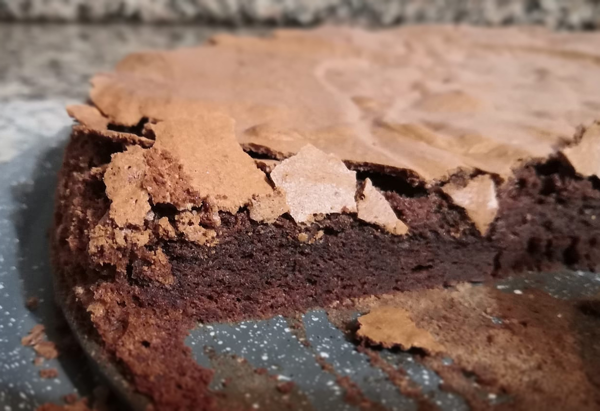

# Tenerina - High density chocolate cake

Tenerina is a dark chocolate cake typical of the province of Ferrara. Known since 1900s as Montenegrina Pie, it has been created for Elena Petrovich, queen of Montenegro, wife of Vittorio Emanuele II the King of Italy [📰][1]. 

## Ingredients
The following table gives amounts to serve 10 (not too hungry) people. Mass: 400g. Calories: ≈2.2 kcal.

| Ingredient  | Q.ty (g)  | Norm. w.r.t. chocolate |
|--|------------------------|------------------------|
| Dark chocolate    | 200 | 1x     |
| Eggs (3x)    | 125 | 0.625x |
| Butter       | 100 | 0.5x   |
| Flour        | 50  | 0.25x  |
| Milk         | 25  | 0.125x |

Dark chocolate may contain 45-90% cocoa solids (>70% when 'extra dark'), the rest is mostly cocoa butter and sugar. You can play with the 'darkness' of chocolate, I like ~60% (e.g. 100g 50% + 100g 70%). There are flours and flours [📰][2], play also with this!

## Method
1. Break the chocolate and melt it a bain-marie or in microwave until smooth and glossy. *Make sure the temperature does not go over 120°C, this would alter the chocolate flavour*. Melt the butter into the hot chocolate, stir well and and let it cool.

2. Beat half of the sugar with the egg yolks until creamy, then sift the flour into the bowl, and mix again until smooth. Add the chocolate and butter mixture and beat it for few seconds until smooth. 

3. Beat the other half of the sugar with the egg whites like when making meringue [📰🇮🇹][2]. *Do not add salt! It destabilizes the foam!*. Incorporate it gently to the mixture.

4. Pour and flatten the dough into a cake pan. It is recommended to use a Ø 24 cm *springform* pan. Bake it for 25 – 30 min at 170°C, fan off. When completely cool, add icing sugar.

## Discussion
TBD.

<!-- ## References -->
[1]: https://www.ferraraterraeacqua.it/it/enogastronomia/prodotti-tipici/torta-tenerina-o-tacolenta
[2]: https://www.kitchenstories.com/en/stories/every-type-of-flour-explained-from-all-purpose-to-type-00
[3]: https://www.youtube.com/watch?v=wKIO9kI__kg

